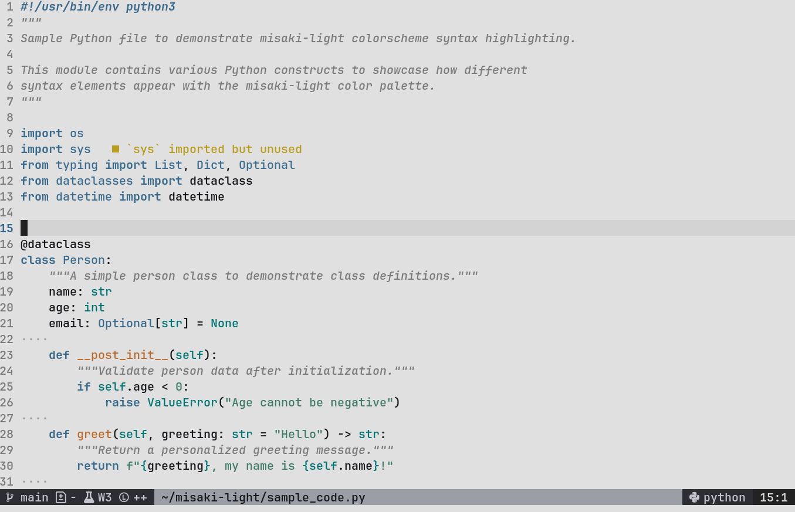

# Misaki Light

A minimal and elegant light color scheme for Neovim with soft pastel colors designed for comfortable daytime coding.


## Features

- 🌸 Soft pastel color palette optimized for light backgrounds
- 👁️ Easy on the eyes with carefully chosen contrast ratios  
- 🎯 Focused syntax highlighting for better code readability
- 🐍 Special support for Python docstrings via Tree-sitter
- 🔧 Built-in diagnostic color support
- ⚡ Lightweight and fast loading

## Color Palette

| Element | Color | Hex Code | Usage |
|---------|-------|----------|-------|
| Background |  | `#e0e0e0` | Main background |
| Foreground |  | `#222222` | Normal text |
| Comment |  | `#7a7a7a` | Comments & docs |
| Blue |  | `#3a6a8c` | Keywords & types |
| Green |  | `#3e7c68` | Strings & constants |
| Orange |  | `#b96a2b` | Functions & classes |
| Line BG |  | `#d3d3d3` | Current line |

### Diagnostic Colors

- **Error**:  `#b0413e`
- **Warning**:  `#b89c1d`
- **Info**:  `#3a6a8c`
- **Hint**:  `#3e7c68`

## Installation

### Using [lazy.nvim](https://github.com/folke/lazy.nvim)

```lua
{
  "sinanh/misaki-light",
  config = function()
    vim.cmd("colorscheme misaki-light")
  end
}
```

### Using [packer.nvim](https://github.com/wbthomason/packer.nvim)

```lua
use {
  "sinanh/misaki-light",
  config = function()
    vim.cmd("colorscheme misaki-light")
  end
}
```

### Using [vim-plug](https://github.com/junegunn/vim-plug)

```vim
Plug 'sinanh/misaki-light'
```

Then add to your `init.vim` or `init.lua`:

```vim
colorscheme misaki-light
```

### Manual Installation

1. Clone the repository:
```bash
git clone https://github.com/sinanh/misaki-light.git
```

2. Copy the colorscheme file to your Neovim colors directory:
```bash
# For Unix/Linux/macOS
cp misaki-light/colors/misaki-light.lua ~/.config/nvim/colors/

# For Windows
cp misaki-light/colors/misaki-light.lua ~/AppData/Local/nvim/colors/
```

3. Add to your Neovim configuration:
```lua
-- init.lua
vim.cmd("colorscheme misaki-light")
```

or

```vim
" init.vim
colorscheme misaki-light
```

## Configuration

The theme works out of the box, but you can customize it further:

```lua
-- Set background explicitly (optional, theme sets this automatically)
vim.o.background = "light"

-- Apply the colorscheme
vim.cmd("colorscheme misaki-light")

-- Optional: Configure additional highlight groups
vim.api.nvim_set_hl(0, "MyCustomGroup", { fg = "#3a6a8c", bold = true })
```

## Requirements

- Neovim >= 0.5.0
- Tree-sitter (optional, for enhanced Python docstring highlighting)

## Screenshots



*The screenshot above shows misaki-light theme in action with Python code, demonstrating the clean syntax highlighting and comfortable light background.*

## Contributing

Contributions are welcome! Please feel free to:

- Report bugs or issues
- Suggest new features or improvements
- Submit pull requests
- Share screenshots of the theme in action

## License

This project is licensed under the MIT License - see the [LICENSE](LICENSE) file for details.

## Acknowledgments

- Inspired by the need for a comfortable light theme for daytime coding
- Built with Neovim's modern highlight API for better performance

---

*Enjoy coding with Misaki Light! 🌸*